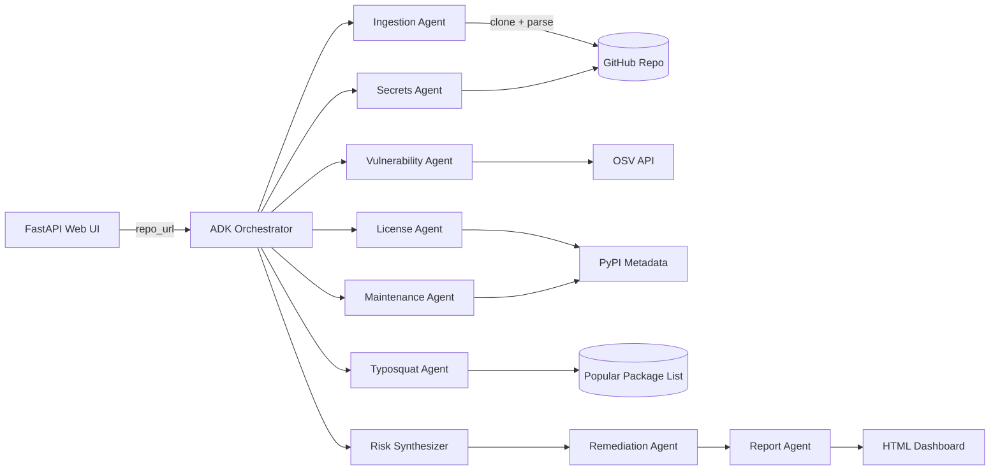

# DepShield

AI-powered software supply chain risk and remediation agent.

## Problem

Open-source dependencies introduce security, legal, and operational risks. Teams rarely have time to audit every package they pull in. DepShield analyzes a repository's dependency tree and produces a prioritized risk report with a concrete remediation plan.

## Features

- **Multi-agent ADK system** — an orchestrator dispatches parallel specialist agents.
- **Vulnerability scanning** — queries the OSV database for known CVEs.
- **License conflict detection** — flags copyleft licenses incompatible with proprietary distribution.
- **Maintenance risk scoring** — uses PyPI metadata to spot abandoned or under-maintained packages.
- **Typosquat detection** — compares package names against popular packages using edit distance.
- **Secret leak scanning** — regex-based scan for API keys and private keys in the repo.
- **Remediation plan generation** — ordered steps to address the top risks.
- **Web dashboard** — FastAPI UI with an HTML report.
- **MCP server** — exposes OSV and typosquat tools via the Model Context Protocol.
- **Agents CLI support** — packaged as an agent skill with `agent.json`.

## Architecture



See [`docs/architecture.md`](docs/architecture.md) for a detailed data-flow description.

## Quick Start

1. Clone the repository:
   ```bash
   git clone https://github.com/Samant-Patil1/deshield.git
   cd deshield
   ```

2. Create and activate a virtual environment:
   ```bash
   python -m venv .venv
   source .venv/bin/activate
   ```

3. Install dependencies:
   ```bash
   pip install -e ".[dev]"
   ```

4. Copy the environment template and add your keys:
   ```bash
   cp .env.example .env
   # Edit .env and set GOOGLE_API_KEY and optionally GITHUB_TOKEN
   ```

5. Run the CLI against a public repo:
   ```bash
   python -m src.main --repo https://github.com/owner/repo
   ```

## Run Web UI

```bash
python -m src.main --serve
```

Then open http://localhost:8080, paste a GitHub repository URL, and submit.

## Run Tests

```bash
pytest tests/ -v
```

## Run MCP Server

```bash
python src/mcp_server.py
```

## Docker

Build and run locally:

```bash
docker build -t deshield .
docker run -p 8080:8080 --env-file .env deshield
```

## Deploy to Google Cloud Run

```bash
gcloud run deploy deshield \
  --source . \
  --region us-central1 \
  --allow-unauthenticated \
  --set-env-vars GOOGLE_API_KEY=$GOOGLE_API_KEY
```

## License

MIT
